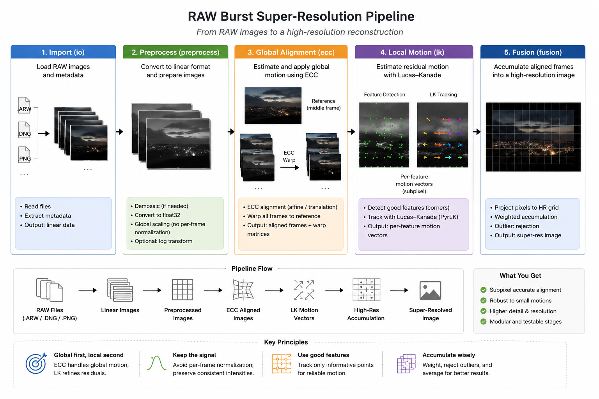

# Multi-Frame Super-Resolution

Takes N RAW images and upscales to a higher resolution JPEG. The image under shows very briefly how it is intended to work:

Note: The "High-res" accumulation will be a continuous vector field for each pixel´s displacement relative to the reference frame. By doing this, the goal is to achieve sub-pixel accuracy, which in turn gives the ability to upscale the image.

### Credit where credit is due
This project is based on work done by Google researches in [this paper](https://sites.google.com/view/handheld-super-res/) and will be a simplified version of it. It will also be inspired by [this implementation](https://github.com/Jamy-L/Handheld-Multi-Frame-Super-Resolution), done by some more skilled developers than myself!

## Progress
- Import and preprocess ✅
- Per-frame global alignement ✅
- Optical flow
- Continuous vector field constructor
- Fusion and export of JPEG

## Dependencies

numpy
rawpy
opencv-python

